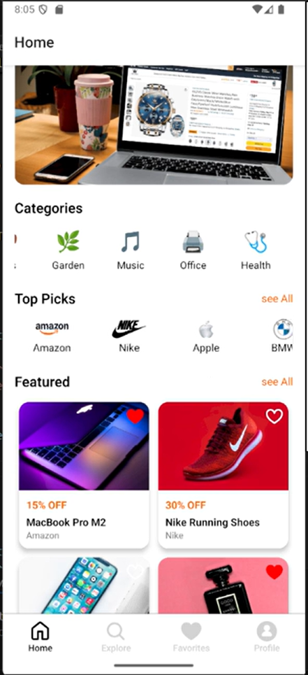
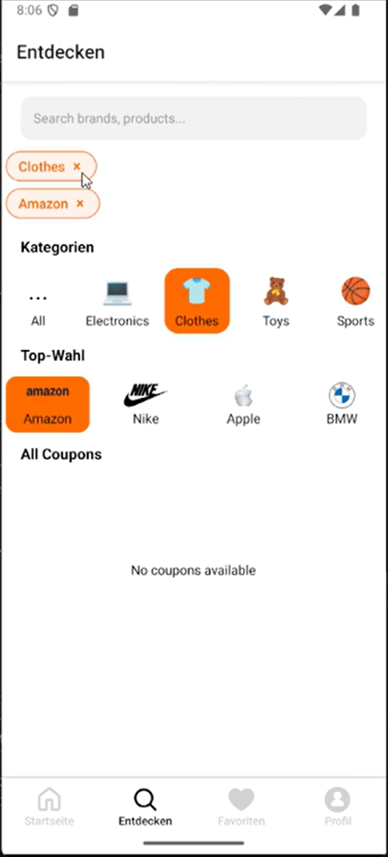
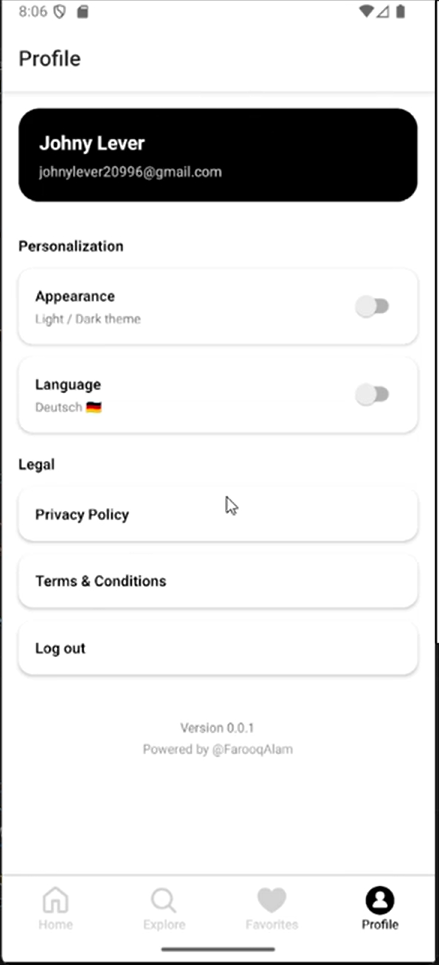

# 🎟️ Coupon App


> A modern **React Native Coupon Application** that helps users discover and save the best deals and discounts.

---

## 🚀 Demo


---

## ✨ Features

- 📱 Modern mobile UI
- 🎟️ Browse available coupons
- 🔎 View coupon details
- ⭐ Save favorite coupons
- ⚡ Fast and lightweight
- 📲 Works on **Android & iOS**

---

## 📸 Screenshots

| Home Screen | Coupon Details | Saved Coupons | Profile |
|-------------|---------------|---------------|
|  |  |  |  |

---

## 🛠️ Tech Stack

- **React Native**
- **JavaScript / TypeScript**
- **React Navigation**
- **Axios**
- **Android Studio**
- **Xcode**

---

# ⚙️ Installation

Clone the repository:

```bash
git clone https://github.com/YOUR_USERNAME/coupon-app.git
```

Go to the project:

```bash
cd coupon-app
```

Install dependencies:

```bash
npm install
```

---

# ▶️ Running the App

Start Metro:

```bash
npm start
```

### Android

```bash
npm run android
```

### iOS

```bash
npm run ios
```

---

# 📂 Project Structure

```
src
 ┣ components
 ┣ screens
 ┣ navigation
 ┣ services
 ┗ assets
```

---

# 🤝 Contributing

Contributions are welcome!

1 Fork the project  
2 Create your feature branch

```
git checkout -b feature/new-feature
```

3 Commit changes

```
git commit -m "Add new feature"
```

4 Push to branch

```
git push origin feature/new-feature
```

5 Open a Pull Request

---

# 📜 License

This project is licensed under the **MIT License**.

---

# 👨‍💻 Author

**Muhammad Farooq Alam Abbasi**

Hybrid Mobile & Web Developer

🌐 Portfolio  
https://farooqalam.com

💼 LinkedIn  
https://www.linkedin.com/in/muhammad-farooq-alam-abbasi-174616153/

🐙 GitHub  
https://github.com/farooqalam20996?tab=respositories

---

⭐ If you like this project, please give it a **star on GitHub**!